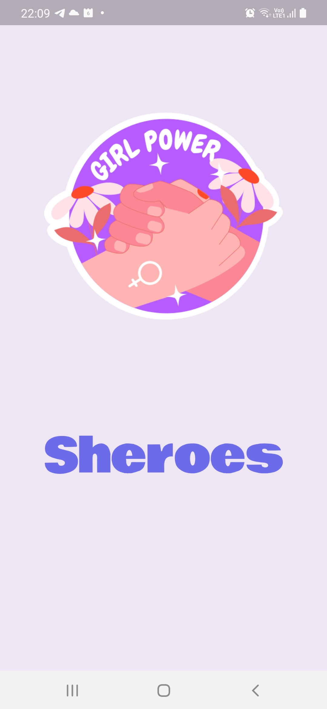
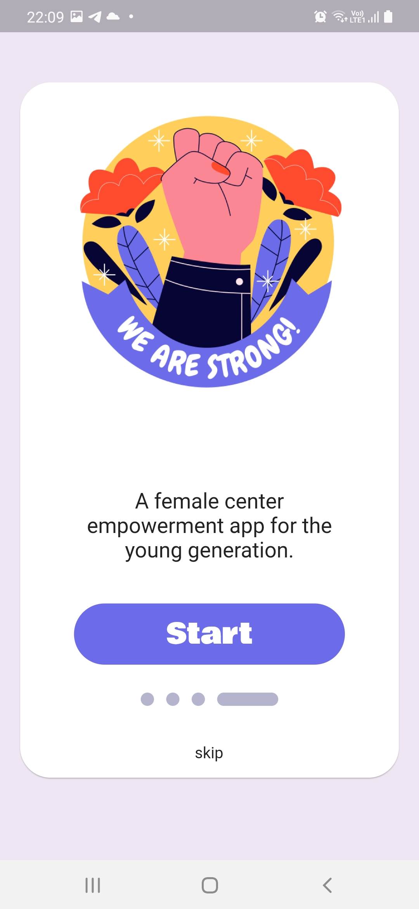
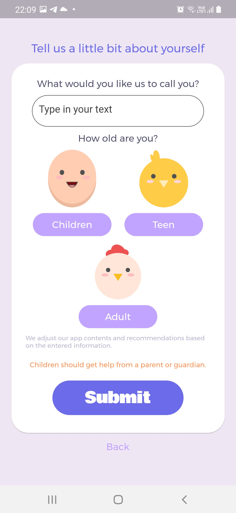
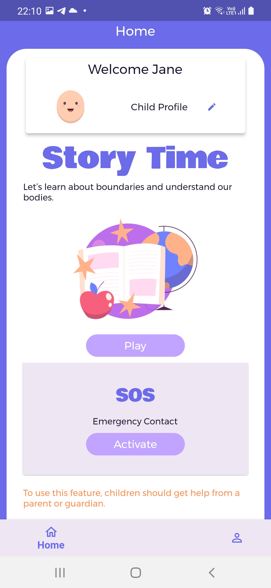
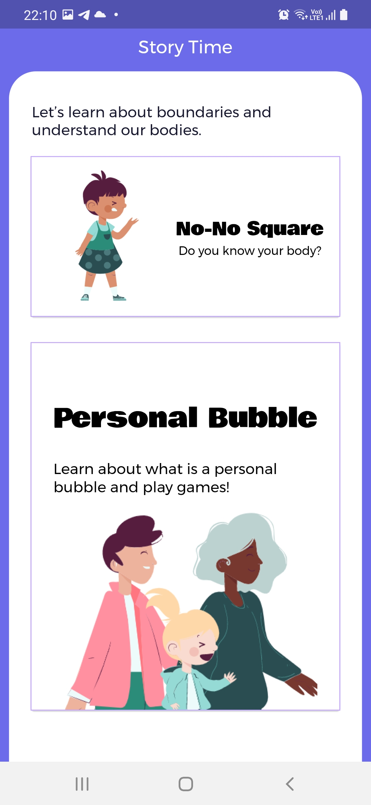
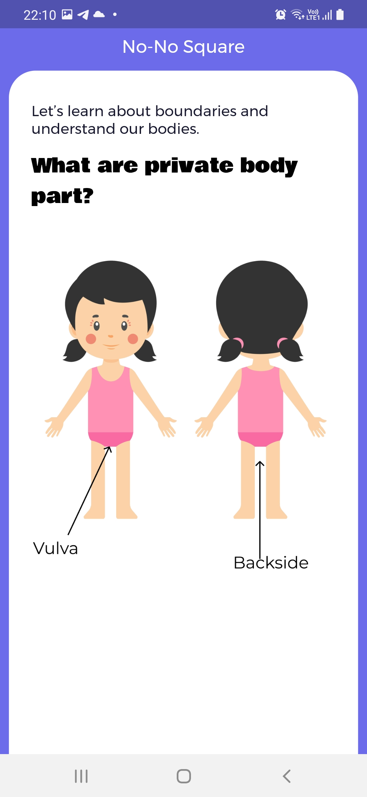
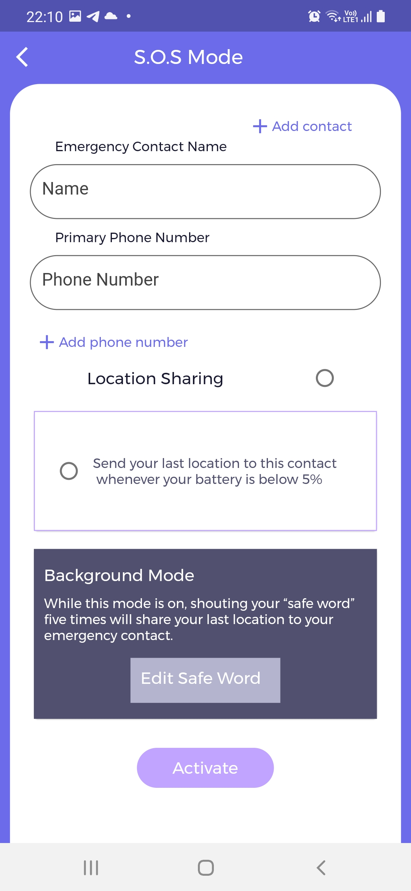
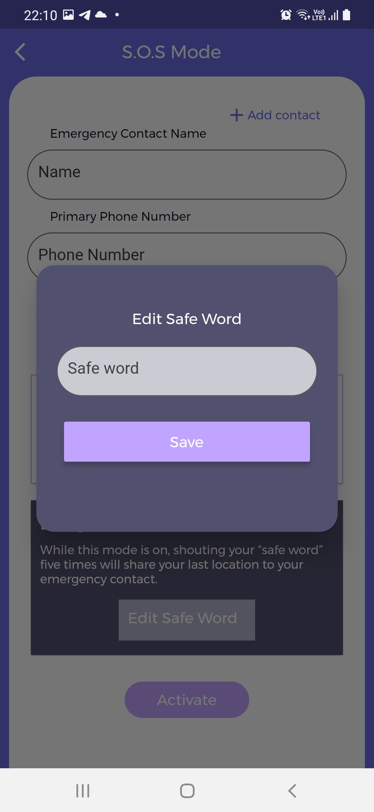
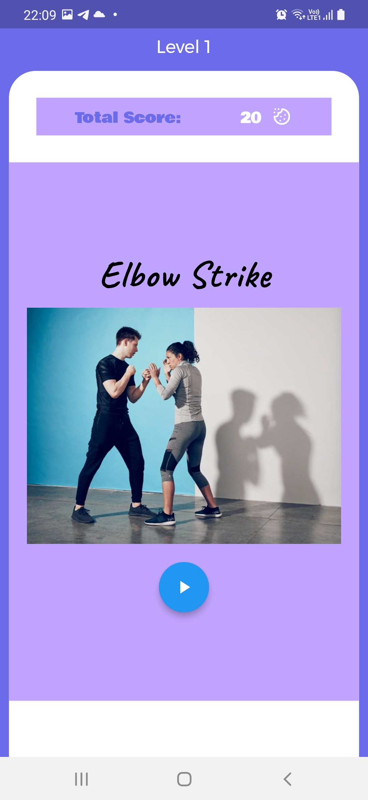
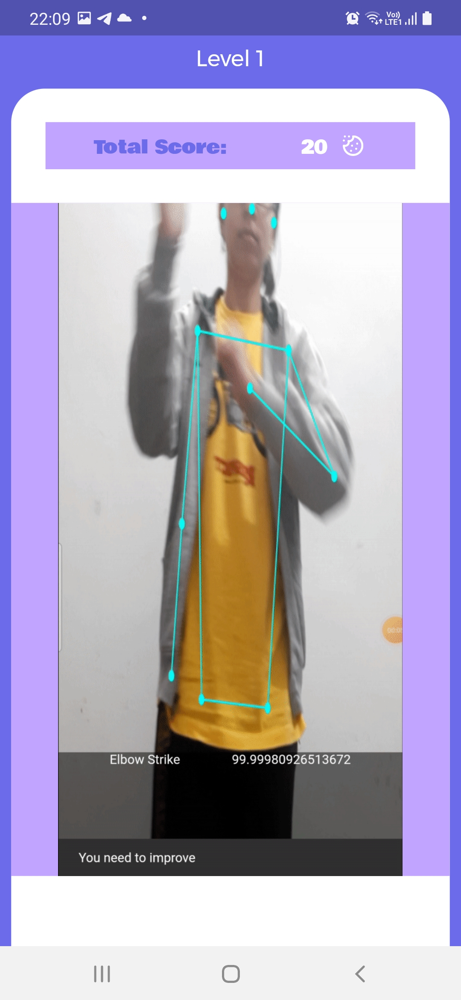

# Sheroes

Sheroes is a Female's safety app with an emergency location-sharing service, self-defense tips, and empowerment stories. We mainly focused on women of all ages with our 3 targeted user groups, which are children(below 13), teens(below 18), and adults(18+). 

It teaches children especially young girls to discover personal boundaries and understand their bodies by using a fun, interactive story mode and allows help from a parent or guardian in setting up our **S.O.S Mode** or our **background mode**. All three user groups are included with this feature. However, for the teen's group, it specializes in a gamified self-defense experience for them to perform certain moves and earn "cookies". For the adult group, they will have both features(Self Defense practice) and SOS and they'll also have access to chat rooms for which they have to connect their Google account. Then they can talk to others and share their sexual harassment or abuse stories and how they dealt with it in workplaces/Universities. This provides a safe forum to share their experience and learn from other users' stories.

**Self-defense training activities** teach teens and adults different techniques they can use when in danger. A machine learning model was trained to identify different techniques and users can practice and know if they are doing that pose accurately.  

**S.O.S Mode** is the main feature of our app, it is to allow users to input their trusted emergency contact, and have the options to whether they would like to send their last location to this contact whenever their phone battery is below 5%. 

**Background Mode** allows users to create a "safe word" and while this mode is on, shouting your “safe word” five times will share your last location to your emergency contact.
Also, we kept the **user's phone battery situation** in mind and added **battery tracking** as well so that the emergency contact knows the user's last location even if their phone shuts down. Not every time user will be in danger hence user gets prompt on their phone and if they don't respond to it then the location SMS is sent to the emergency contact.

## Screenshots
<pre>
             

</pre>
